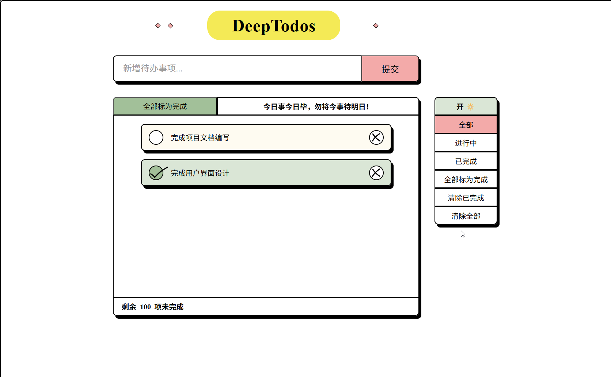

# 🚀 DeepTodos
[](https://opensource.org/licenses/MIT)
[](https://github.com/Jarod-father/DeepTodos/releases)
[](https://github.com/Li-Wend/DeepTodos/actions/workflows/ci.yml)

[DeepTodos Wiki 文档](https://github.com/Li-Wend/DeepTodos/wiki)

轻量的待办事项（Todo）应用，包含前后端示例与完整开发流程文档，便于快速上手与二次开发。

## 🧩 主要功能
- ✅ 用户注册 / 登录 / 注销 / 密码重置 / 邮箱验证
- ✅ 添加 / 删除任务
- ✅ TODO: 任务完成状态（已完成 / 未完成）

## 🛠️ 技术栈
- 后端：Python 3.13+, FastAPI, SQLAlchemy, FastAPI-Users, uv（项目管理）, venv（虚拟环境）， pytest（测试框架）
- 前端：Vue 3 + Composition API, Vite, Pinia, unplugin-vue-router, vite-plugin-vue-layouts, TypeScript, SCSS
- UI设计与管理：Pixso
- 包管理：pnpm / nvm

## 🎯 前提条件 
- Python 3.13+
- pip 24.3+
- Node.js 22.18+（推荐）
- Git 2.38+
- 推荐 IDE：VS Code（推荐安装 Volar）

---

## 🔫 快速启动

* TODO: Docker从头开始配置项目。如何使用Docker？现阶段不考虑使用 Docker 对项目进行管理。

* TODO: 如何保证其他人也是用相同的Python 版本 Python版本：3.13

克隆项目

```bash
git clone https://github.com/Jarod-father/DeepTodos.git
cd deeptodos
```

以下命令在项目根目录下执行。

### 后端（DeepTodos/backend/deeptodos）
1. 进入后端目录：
```sh
cd .\backend\deeptodos\
```
2. 安装 uv（两种方式任选其一）：
```sh
pip install uv
# or
curl -LsSf https://astral.sh/uv/install.sh | sh
```
3. 创建并激活虚拟环境：
```sh
uv venv
.venv\Scripts\activate  # Windows 示例：请在虚拟环境中运行
```
4. 安装后端依赖（根据 uv.lock）：
```sh
uv sync
```
5. 运行后端：
```sh
uv run main.py
```
> 依赖变更同步流程：
```sh
# 1.开发者A 添加新依赖
uv add <new package>
# 2.提交 pyproject.toml / uv.lock
# 3.开发者B 拉取后
uv sync
```

### 前端（DeepTodos/frontend/deeptodos）
1. 进入前端目录：
```sh
cd .\frontend\deeptodos\
```
2. 安装 nvm (nvm 的安装方法取决于您的操作系统)
```sh
# 1. macOS / Linux
curl -o- https://raw.githubusercontent.com/nvm-sh/nvm/v0.39.7/install.sh | bash
# 2. Windows
# 请安装独立的 nvm-windows版本。访问其 [GitHub 发布页面](https://github.com/coreybutler/nvm-windows/releases)，下载并运行 .exe安装程序。
# 3. 安装后，重新打开终端，运行 nvm -v验证。
nvm -v
```
3. 使用 nvm 切换到推荐 Node 版本(22.18.0 (Currently using 64-bit executable))
```sh
nvm install 22.18.0 # 安装指定版本
nvm use 22.18.0 # 切换版本 [example]
nvm list # 查看已安装版本
```
4. 安装 pnpm（如未安装）并安装依赖：
```sh
npm install -g pnpm
pnpm install
```
5. 启动开发服务：
```sh
pnpm dev
```
6. 同步依赖变化的流程：
```sh
# 1. 添加新依赖
pnpm add <package-name>
# 2. 更新指定包
pnpm update <package-name>
# 3. 移除不需要的包
pnpm remove <package-name>
# 4. 执行安装，同步所有变更到 node_modules
pnpm install
```

---

## 📝 常用命令
- 后端启动：uv run main.py
- 前端开发：pnpm dev
- 打包前端：pnpm build
- 运行测试（后端）：参见 tests 目录与 run_tests.py

---

## 🚧 目录概览（部分）
- backend/deeptodos/ — 后端代码（FastAPI/服务/模型/路由）
- frontend/deeptodos/ — 前端代码（Vue 3 + Vite）
- frontend/deeptodos/src/pages/ — 页面路由（配合 unplugin-vue-router）
- README_backup.md — 备份文档与补充说明

---

## 👩‍💻 贡献指南
1. 新建分支（例如：dev）
2. 修改代码并提交：
```sh
git checkout -b dev
git add .
git commit -m "描述"
git push origin dev
```
3. 发起 PR 并合并到主分支 main

---

## 🎨 前端 UI 设计
Pixso 设计文件只有被指定的协作者才有访问权限。
[邀请您加入 Pixso 设计文件「DeepTodos 设计文件」](https://pixso.cn/app/design/i8mKsgtnWmgJ1KeYW4_NPA?file_type=10&icon_type=1&page-id=2%3A2&item-id=24%3A63)

---

## 🖱️ 使用方法 
登录页<br>

注册页<br>

任务管理页面<br>


## ⚖️ 许可证 
[Licenses: MIT](https://choosealicense.com/licenses/mit/)